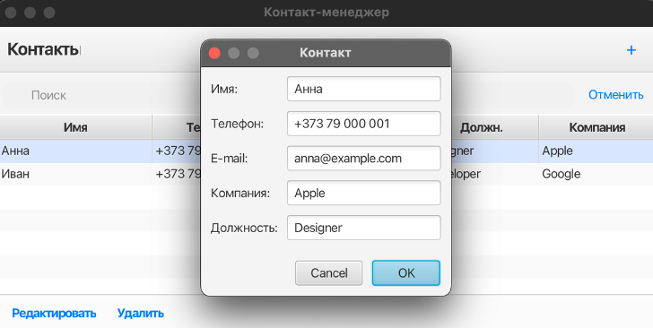

# ContactManager-JavaFX
Desktop application for managing personal and business contacts, built with Java and JavaFX. Includes contact filtering, validation, and custom exception handling.

# ContactManager-JavaFX

Менеджер контактов — это настольное приложение, реализованное на языке Java с использованием JavaFX. Проект позволяет управлять персональными и деловыми контактами: добавлять, редактировать, удалять и фильтровать записи по имени или типу контакта.

## Возможности

- Добавление, редактирование и удаление контактов
- Поиск и фильтрация по имени или типу
- Валидация данных (email, телефон)
- Кастомные исключения
- Графический интерфейс на JavaFX с использованием FXML

## Изученные темы Java

- Классы и объекты
- Наследование и полиморфизм
- Перегрузка методов
- Коллекции и их обход (List, ObservableList)
- Обработка ошибок с помощью собственных исключений
- Многослойная архитектура (Model — Logic — UI)
- FXML, TableView, контроллеры в JavaFX

## Скриншоты

